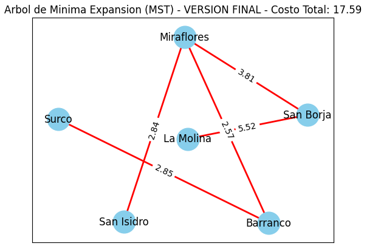

# ADA KruskalMST-for-EVs

### DESCRIPCION

Este proyecto desarrolla un algoritmo de Kruskal adaptado específicamente para optimizar la red de estaciones de carga de autos eléctricos en una zona urbana. Utilizando datos geográficos, el algoritmo identifica las conexiones más cortas entre distritos para minimizar la distancia total, facilitando un acceso eficiente a la carga de vehículos eléctricos. El resultado se visualiza a través de un mapa interactivo HTML que muestra el Árbol de Mínima Expansión (MST), destacando las conexiones óptimas entre las estaciones y proporcionando una herramienta útil para la planificación de infraestructuras de carga.

### MAPEO REALISTA
A continuación se muestra la implementación real a nivel nacional

### MAPEO SENCILLO
A continuación se muestra la implementación pragmatica

